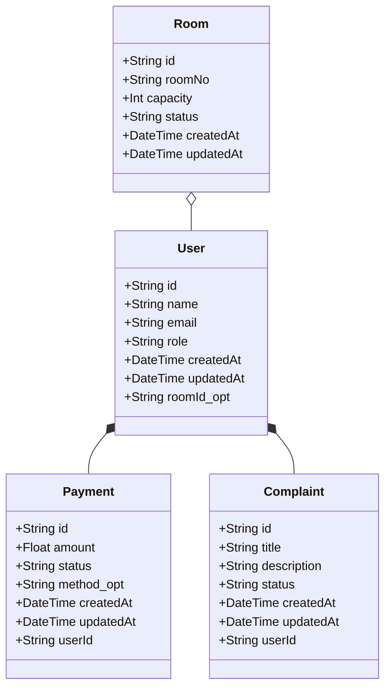
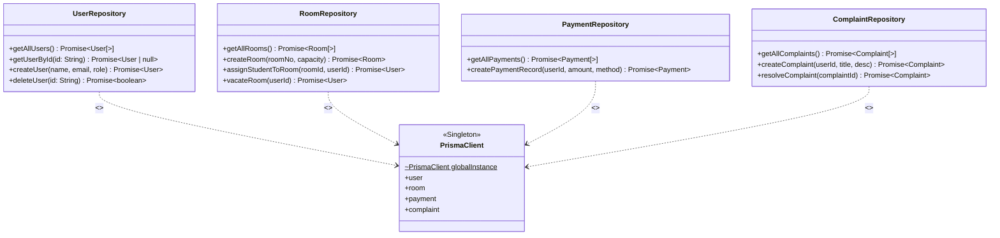
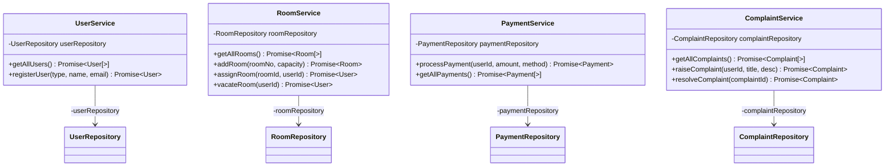
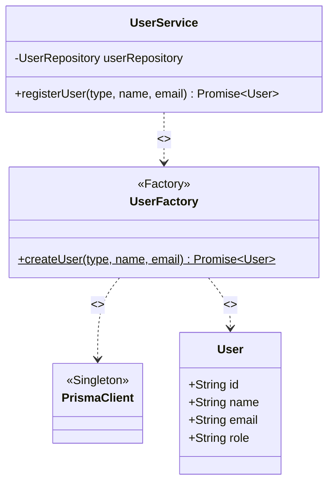
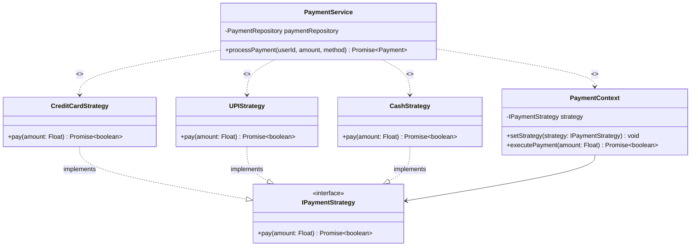
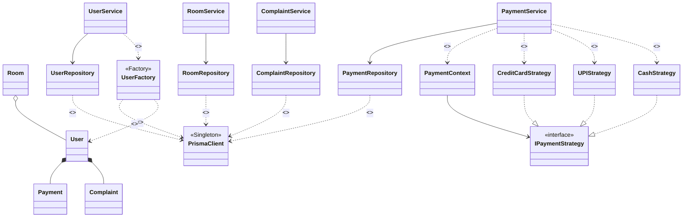

# SmartStay Hostel Management System — UML Class Diagram

---

## 1. UML Notation Legend

### Access Modifiers

| Symbol | Meaning                                                           |
| :----: | ----------------------------------------------------------------- |
| `+` | **Public** — accessible from anywhere                      |
| `-` | **Private** — accessible only within the class             |
| `#` | **Protected** — accessible within the class and subclasses |
| `~` | **Package** — accessible within the same module            |
| `$` | **Static** — belongs to the class itself, not instances    |

### Relationships & Arrows

| Mermaid Syntax | UML Name                       |    Visual    | Description                                                      |
| :------------: | ------------------------------ | :----------: | ---------------------------------------------------------------- |
|    `<\|--`    | **Inheritance**          | `───▷` | Solid line + closed triangle. Class extends another.             |
|    `<\|..`    | **Realization**          |  `┄┄▷`  | Dashed line + closed triangle. Class implements an interface.    |
|    `-->`    | **Directed Association** | `───▶` | Solid line + open arrow. A stores B as a field (one-way).        |
|    `o--`    | **Aggregation**          | `◇───` | Solid line + open diamond. "Has-a" — parts exist independently. |
|    `*--`    | **Composition**          | `◆───` | Solid line + filled diamond. "Owns" — parts die with the whole. |
|    `..>`    | **Dependency**           |  `┄┄▶`  | Dashed line + open arrow. Temporary use (not stored as field).   |

### Dependency Stereotypes

| Label          | Meaning                               | Example                                          |
| -------------- | ------------------------------------- | ------------------------------------------------ |
| `«use»`    | Calls methods on B temporarily        | `Repository «use» PrismaClient`              |
| `«create»` | Creates new instances via `new B()` | `PaymentService «create» CreditCardStrategy` |

> [!NOTE]
> `«use»` and `«create»` are **NOT** separate relationship types — they are **labels on the same Dependency arrow** (`..>`) to clarify the nature of the dependency.

---

## 2. Domain Models

> Entities derived from the Prisma schema — shows data structure and how models relate to each other.

| Relationship              | Type                  | Why?                                              |
| ------------------------- | --------------------- | ------------------------------------------------- |
| `Room ◇── User`      | **Aggregation** | Room exists independently and has occupants.      |
| `User ◆── Payment`   | **Composition** | Payment lifecycle depends entirely on the User.   |
| `User ◆── Complaint` | **Composition** | Complaint lifecycle depends entirely on the User. |

---

## 3. Repository Layer

> Abstraction over data access. Repositories use the PrismaClient singleton via `«use»` dependency.

| Relationship                        | Type                         | Why?                                                                                          |
| ----------------------------------- | ---------------------------- | --------------------------------------------------------------------------------------------- |
| `*Repository ┄┄▶ PrismaClient` | **Dependency «use»** | Repos call `prisma.model.method()` — they use the singleton but don't store it as a field. |

---

## 4. Service Layer

> Business logic layer. Each service holds a **private** reference to its repository (Directed Association) and delegates data operations to it.

| Relationship                  | Type                           | Why?                                                                                                                                         |
| ----------------------------- | ------------------------------ | -------------------------------------------------------------------------------------------------------------------------------------------- |
| `Service ──▶ Repository` | **Directed Association** | Each service stores its repository as a**private field** (`-`). One-way: Service knows Repository, Repository does NOT know Service. |

---

## 5. Factory Pattern — UserFactory

> Encapsulates User creation logic. The `UserService` depends on `UserFactory` via a `«use»` dependency (calls its static method, does not store it).

| Relationship                        | Type                            | Why?                                                                                 |
| ----------------------------------- | ------------------------------- | ------------------------------------------------------------------------------------ |
| `UserService ┄┄▶ UserFactory`  | **Dependency «use»**    | Service calls `UserFactory.createUser()` — a static method call, no field stored. |
| `UserFactory ┄┄▶ PrismaClient` | **Dependency «use»**    | Factory calls `prisma.user.create()` internally.                                   |
| `UserFactory ┄┄▶ User`         | **Dependency «create»** | Factory instantiates User records.                                                   |

---

## 6. Strategy Pattern — Payment Processing

> Allows swapping payment algorithms at runtime. `PaymentService` creates (`«create»`) the context and concrete strategies. `PaymentContext` stores the strategy as a private field (Directed Association).

| Relationship                               | Type                            | Why?                                                                                        |
| ------------------------------------------ | ------------------------------- | ------------------------------------------------------------------------------------------- |
| `*Strategy ┄┄▷ IPaymentStrategy`      | **Realization**           | Concrete strategies implement the interface.                                                |
| `PaymentContext ──▶ IPaymentStrategy` | **Directed Association**  | Context stores active strategy as a **private field** (`-strategy`).               |
| `PaymentService ┄┄▶ *Strategy`        | **Dependency «create»** | Service does `new CreditCardStrategy()` etc. — creates instances but doesn't store them. |
| `PaymentService ┄┄▶ PaymentContext`   | **Dependency «create»** | Service does `new PaymentContext(strategy)` — creates it locally per request.            |

---

## 7. Full System Overview (Simplified)

> High-level view showing all layers and how they connect. Classes are simplified to show only the relationship structure.

---

## 8. Summary Tables

### All Access Modifiers Used

| Modifier | Symbol | Where Used                                                                                                                                                                  |
| :------: | :----: | --------------------------------------------------------------------------------------------------------------------------------------------------------------------------- |
|  Public  | `+` | All domain attributes, all repository & service public methods, strategy `pay()`, factory `createUser()$`                                                               |
| Private | `-` | `UserService.userRepository`, `RoomService.roomRepository`, `PaymentService.paymentRepository`, `ComplaintService.complaintRepository`, `PaymentContext.strategy` |
| Package | `~` | `PrismaClient.globalInstance` (module-scoped singleton)                                                                                                                   |
|  Static  | `$` | `UserFactory.createUser()`                                                                                                                                                |

### All Relationship Types Used

| # | Type                            |    Arrow    | Count | Where                                                                |
| :-: | ------------------------------- | :----------: | :---: | -------------------------------------------------------------------- |
| 1 | **Aggregation**           | `◇───` |   1   | Room↔User                                                           |
| 2 | **Composition**           | `◆───` |   2   | User↔Payment, User↔Complaint                                       |
| 3 | **Directed Association**  | `───▶` |   5   | 4× Service→Repository, Context→Strategy                           |
| 4 | **Realization**           |  `┄┄▷`  |   3   | 3× Strategy→IPaymentStrategy                                       |
| 5 | **Dependency «use»**    |  `┄┄▶`  |   6   | 4× Repository→Prisma, Factory→Prisma, Service→Factory            |
| 6 | **Dependency «create»** |  `┄┄▶`  |   5   | PaymentService→Context, PaymentService→3 Strategies, Factory→User |

### Design Patterns

| Pattern                  | Where                 | Key Classes                                                                                         |
| ------------------------ | --------------------- | --------------------------------------------------------------------------------------------------- |
| **Singleton**      | `src/lib/prisma.ts` | `PrismaClient`                                                                                    |
| **Factory Method** | `src/factories/`    | `UserFactory` → `User`                                                                         |
| **Strategy**       | `src/strategies/`   | `IPaymentStrategy`, `CreditCardStrategy`, `UPIStrategy`, `CashStrategy`, `PaymentContext` |
| **Repository**     | `src/repositories/` | `UserRepository`, `RoomRepository`, `PaymentRepository`, `ComplaintRepository`              |
